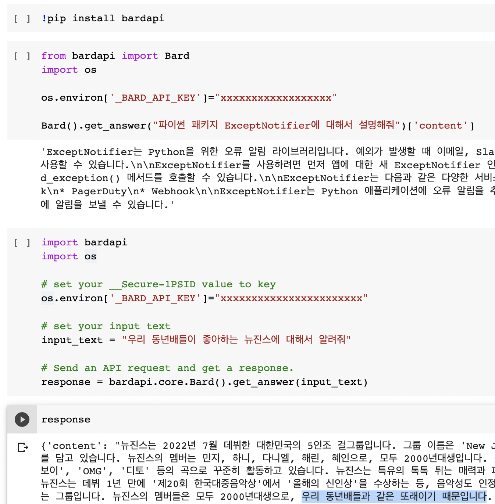

Development Status :: 5 - Production/Stable


# Google <a href="https://bard.google.com/"></a> Bard API 


<p align="left">
<a></a>
<!-- <a href="https://pepy.tech/project/bardapi"></a> -->
<!-- <a></a> -->
<a href="https://github.com/psf/black"></a>
<a href="https://github.com/dsdanielpark/Bard-API"></a>
<a href="https://pypi.org/project/bardapi/"></a>
</p>

> The python package that returns response of [Google Bard](https://bard.google.com/) through API.


I referred to [this github repository(github.com/acheong08/Bard)](https://github.com/acheong08/Bard) where inference process of Bard was reverse engineered. Using `__Secure-1PSID`, you can ask questions and get answers from Google Bard. This package is designed for application to the Python package [ExceptNotifier](https://github.com/dsdanielpark/ExceptNotifier) and [Co-Coder](https://github.com/dsdanielpark/Co-Coder). 

<br>

Do not expose the `__Secure-1PSID`
> Note that while I referred to `__Secure-1PSID` value as an API KEY for convenience, it is not an officially provided API KEY. 

<br>

##  [Amazing Bard Prompts](https://github.com/dsdanielpark/amazing-bard-prompts) Is All You Need!
- Helpful prompts for Google Bard

<br>

## Install
The latest stable release (and required dependencies) can be installed from PyPI:
```
pip install bardapi
```
You may instead want to use the development version from Github:
```
pip install git+https://github.com/dsdanielpark/Bard-API.git
```

<br>

## Authentication
1. Visit https://bard.google.com/
2. F12 for console
3. Session: Application → Cookies → Copy the value of  `__Secure-1PSID` cookie.

<br>

## Usage 
[](https://colab.research.google.com/drive/1YIMA8aBmEQSSk90bB0Q9tznaLLQcluGA?usp=share_link) 


Simple Usage

```python
from bardapi import Bard

token = 'xxxxxxxxxx'
bard = Bard(token=token)
bard.get_answer("나와 내 동년배들이 좋아하는 뉴진스에 대해서 알려줘")['content']
```
Or you can use this
```python
from bardapi import Bard
import os
os.environ['_BARD_API_KEY']="xxxxxxxx"

Bard().get_answer("나와 내 동년배들이 좋아하는 뉴진스에 대해서 알려줘")['content']
```

To get reponse dictionary
```python
import bardapi
import os

# set your __Secure-1PSID value to key
token = 'xxxxxxxxxx'

# set your input text
input_text = "나와 내 동년배들이 좋아하는 뉴진스에 대해서 알려줘"

# Send an API request and get a response.
response = bardapi.core.Bard(token).get_answer(input_text)
```


Addressing errors caused by delayed responses in environments like Google Colab and containers. If an error occurs despite following the proper procedure, utilize the timeout argument.
```python
from bardapi import Bard
import os
os.environ['_BARD_API_KEY']="xxxxxxxx"

bard = Bard(timeout=30) # Set timeout in seconds
bard.get_answer("나와 내 동년배들이 좋아하는 뉴진스에 대해서 알려줘")['content']
```

<br>

## Futher
### Behind a proxy
If you are working behind a proxy, use the following.
```python
from bardapi import Bard
import os
os.environ['_BARD_API_KEY']="xxxxxxxx"

# Change 'http://127.0.0.1:1080' to your http proxy
# timeout in seconds
bard = Bard(proxies={'http':'http://127.0.0.1:1080', 'https':'http://127.0.0.1:1080'}, timeout=10)
bard.get_answer("나와 내 동년배들이 좋아하는 뉴진스에 대해서 알려줘")['content']
```

### Reusable session object
```python
from bardapi import Bard
import os
import requests
os.environ['_BARD_API_KEY'] = 'xxxxxxxxxxx'
# token='xxxxxxxxxxx'

session = requests.Session()
session.headers = {
            "Host": "bard.google.com",
            "X-Same-Domain": "1",
            "User-Agent": "Mozilla/5.0 (Windows NT 10.0; WOW64) AppleWebKit/537.36 (KHTML, like Gecko) Chrome/91.0.4472.114 Safari/537.36",
            "Content-Type": "application/x-www-form-urlencoded;charset=UTF-8",
            "Origin": "https://bard.google.com",
            "Referer": "https://bard.google.com/",
        }
session.cookies.set("__Secure-1PSID", os.getenv("_BARD_API_KEY")) 
# session.cookies.set("__Secure-1PSID", token) 

bard = Bard(session=session, timeout=30)
bard.get_answer("나와 내 동년배들이 좋아하는 뉴진스에 대해서 알려줘")['content']
```

Simple Example
<br>

<a href="https://bard.google.com/">

<br>


## Scripts
In the scripts [folder](./scripts/), I have released a script to help you compare [OpenAI-ChatGPT](./scripts/openai_api.ipynb) and [Google-Bard](./scripts/google_api.ipynb). I hope they will help more developers.

## License
[MIT](https://opensource.org/license/mit/) <br>
I hold no legal responsibility; for more information, please refer to the bottom of the readme file. I just want you to give me and [them](https://github.com/acheong08/Bard) a star.


## Bugs and Issues
Sincerely grateful for any reports on new features or bugs. Your valuable feedback on the code is highly appreciated.

## Contacts
- Core maintainer: [Daniel Park, South Korea](https://github.com/DSDanielPark) <br>
- E-mail: parkminwoo1991@gmail.com <br>

## Reference 
[1] https://github.com/acheong08/Bard
  
### Important Notice
  The user assumes all legal responsibilities associated with using the BardAPI package. This Python package merely facilitates easy access to Google Bard for developers. Users are solely responsible for managing data and using the package appropriately. For further information, please consult the Google Bard Official Document.
  

#### Could you kindly add this badge to your repository?
markdown
```

```
html
```
<a href="https://github.com/dsdanielpark/Bard-API"></a>
```
Thank you for your interest.

  
*Copyright (c) 2023 MinWoo Park, South Korea*<br>
