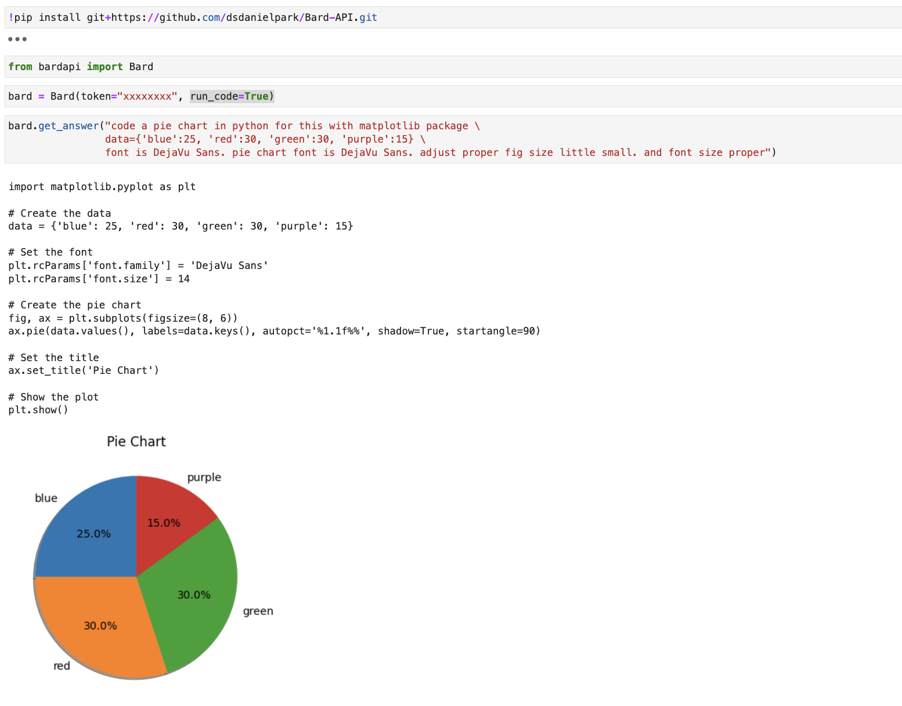
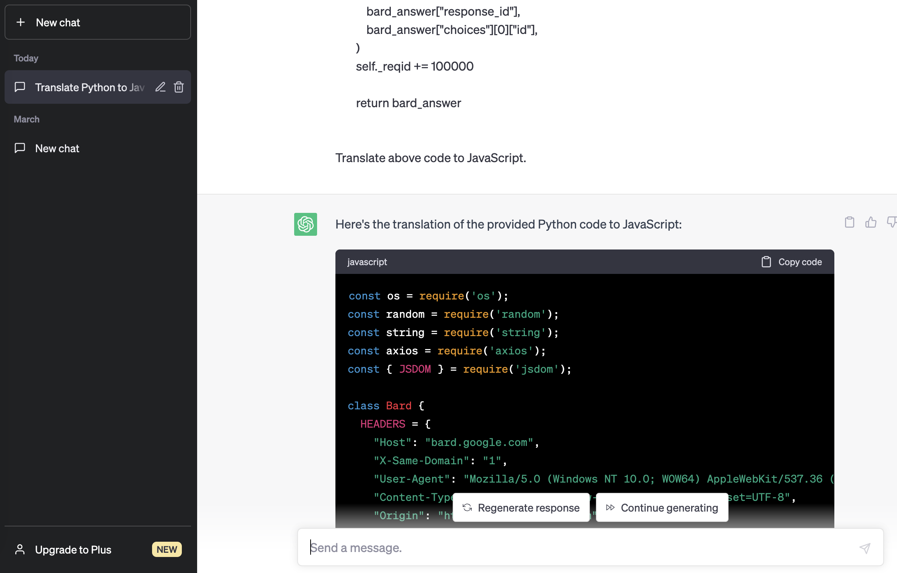

Development Status :: 5 - Production/Stable


# GitHub installation required for the following features.
To remove the dependencies of the bardapi package, you need to install the GitHub developer version.
```
pip install git+https://github.com/dsdanielpark/Bard-API.git
```


# Contents
- [GitHub installation required for the following features.](#github-installation-required-for-the-following-features)
- [Contents](#contents)
    - [Multi-language Bard API](#multi-language-bard-api)
    - [Get image links](#get-image-links)
    - [ChatBard](#chatbard)
    - [Executing Python code received as a response from Bard](#executing-python-code-received-as-a-response-from-bard)
    - [Using Bard asynchronously](#using-bard-asynchronously)
    - [Bard which can get Cookies](#bard-which-can-get-cookies)
    - [Fix Conversation ID (Fix Context)](#fix-conversation-id-fix-context)
    - [Translation to Another Programming Language](#translation-to-another-programming-language)


<br>

### Multi-language Bard API
GitHub Dev version only.
```python
from bardapi import Bard

bard = Bard(token='xxxxxxxx', language='chinese (simplified)')
res = bard.get_answer("你好。")
print(res['content'])
```
or
```python
from bardapi import Bard
import os
os.environ["_BARD_API_LANG"] = 'chinese (simplified)'
os.environ["_BARD_API_KEY"] = 'xxxxxxxxx'

res = Bard().get_answer("你好。")
print(res['content'])
```

<br>

### Get image links
GitHub Dev version only.
```python
from bardapi import Bard
bard = Bard(token='xxxxxxxxx')
res = bard.get_answer("Find me an image of the main entrance of Stanford University.")
res['links'] # Get image links (list)
res['images'] # Get images (set)
```


<br>
    
### ChatBard
```python
from bardapi import ChatBard
    
chat = ChatBard()
chat.start()
```
or
```python
from bardapi import ChatBard
import os
os.environ["_BARD_API_KEY"] = 'xxxxxxxxx'   # Requird
os.environ["_BARD_API_LANG"] = Arabic    # Optional, Default to English
os.environ["_BARD_API_TIMEOUT"] = 30     # Optional, Session Timeout
 
chat = ChatBard()
chat.start()
```
or
```python
from bardapi import Bard, SESSION_HEADERS
import os
import requests

token='xxxxxxxxx'
session = requests.Session()
session.headers = SESSION_HEADERS
session.cookies.set("__Secure-1PSID", token) 
proxies = {
    'http': 'http://proxy.example.com:8080',
    'https': 'https://proxy.example.com:8080'
}
    
ChatBard(token=token, session=session, proxies=proxies, timeout=40, language="chinese (simplified)").start()
```

<br>    

### Executing Python code received as a response from Bard
GitHub Dev version only.
```python
from bardapi import Bard
    
bard = Bard(token="xxxxxxxxx", run_code=True)
bard.get_answer("code a pie chart in python for this data={'blue':25, 'red':30, 'green':30, 'purple':15}")
```

    
<br>

### Using Bard asynchronously 
GitHub Dev version only.    
    
Using asynchronous implementation will be efficient when implementing ChatBots or something alone those lines.    
BardAsync is not using requests library instead it is using httpx library and http2 protocol.
    
BardAsync is present in translate_to.core_async.BardAsync
```python
from bardapi import BardAsync 
    
bard = BardAsync(token="xxxxxxxxx")
await bard.get_answer("What is Metaverse?")
```
or
```python
import asyncio
from bardapi import BardAsync
    
bard = BardAsync(token="xxxxxxxxx")
asyncio.run(bard.get_answer("What is Metaverse?"))
```

<br>
    

### Bard which can get Cookies
GitHub Dev version only.    

```python
from bardapi import BardCookies

cookie_dict = {
    "__Secure-1PSID": "xxxxxxxxx",
    "__Secure-1PSIDTS": "xxxxxxxxx",
    # Any cookie values you want to pass session object.
}

bard = BardCookies(cookie_dict=cookie_dict)

print(bard.get_answer("こんにちは"))
```

<br>

### Fix Conversation ID (Fix Context)
BART returns multiple responses as candidate answers. Each of these responses is assigned a conversation_id. While using a reusable session, you can observe that your prompt is stored. However, if you desire consistent answers, you can provide the desired conversation_id as an argument among the returned candidate answers.

- Passing only the `session`: Retains your prompt.
- Passing both `session` and `conversation_id`: Retains your prompt and allows you to receive answers with consistent parameters.

```python
from bardapi import Bard, SESSION_HEADERS
import os
import requests

# Set token
token= 'xxxxxxxxx'

# Set session
session = requests.Session()
session.headers = SESSION_HEADERS
session.cookies.set("__Secure-1PSID", token) 

# Give session and conversation id
bard = Bard(token=token, session=session, conversation_id="c_1f04f704a788e6e4", timeout=30)
bard.get_answer("나와 내 동년배들이 좋아하는 뉴진스에 대해서 알려줘")['content']
```

<br>

### Translation to Another Programming Language
Please check the translation results in [this folder](https://github.com/dsdanielpark/Bard-API/tree/main/translate_to).
- Copy the code of [Core.py](https://github.com/dsdanielpark/Bard-API/blob/17d5e948d4afc535317de3964232ab82fe223521/bardapi/core.py).
- Ask ChatGPT to translate like "Translate to Swift."
- Ask ChatGPT to optimize the code or provide any desired instructions until you're satisfied.<br>


            
            
