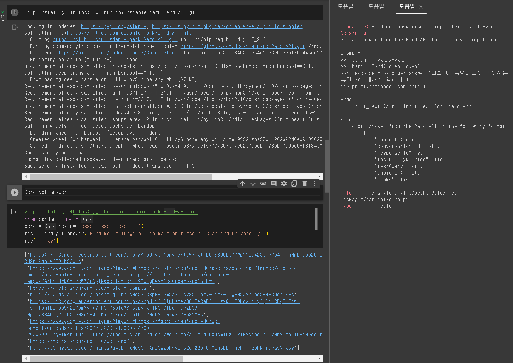

Development Status :: 5 - Production/Stable


# GitHub installation required for the following features.
To remove the dependencies of the bardapi package, you need to install the GitHub developer version.
```
pip install git+https://github.com/dsdanielpark/Bard-API.git
```

### Multi-language Bard API
GitHub Dev version only.
```python
from bardapi import Bard

bard = Bard(token='xxxxxxxx', language='chinese (simplified)')
res = bard.get_answer("你好。")
print(res['content'])
```
or
```python
from bardapi import Bard
import os
os.environ["_BARD_API_LANG"] = 'chinese (simplified)'
os.environ["_BARD_API_KEY"] = 'xxxxxxxx'

res = Bard().get_answer("你好。")
print(res['content'])
```

<br>

### Get image links
GitHub Dev version only.
```python
from bardapi import Bard
bard = Bard(token='xxxxxxxxxxx')
res = bard.get_answer("Find me an image of the main entrance of Stanford University.")
res['links'] # Get image links (list)
res['images'] # Get images (set)
```
<a href="https://bard.google.com/">

<br>
    
### ChatBard
```python
from bardapi import ChatBard
    
chat = ChatBard()
chat.start()
```
or
```python
from bardapi import ChatBard
import os
os.environ["_BARD_API_KEY"] = 'xxxxxx'   # Requird
os.environ["_BARD_API_LANG"] = Arabic    # Optional, Default to English
os.environ["_BARD_API_TIMEOUT"] = 30     # Optional, Session Timeout
 
chat = ChatBard()
chat.start()
```
or
```python
from bardapi import Bard, SESSION_HEADERS
import os
import requests

token='xxxxxxxxxxx'
session = requests.Session()
session.headers = SESSION_HEADERS
session.cookies.set("__Secure-1PSID", token) 
proxies = {
    'http': 'http://proxy.example.com:8080',
    'https': 'https://proxy.example.com:8080'
}
    
ChatBard(token=token, session=session, proxies=proxies, timeout=40, language="chinese (simplified)").start()
```

<br>    

### Executing Python code received as a response from Bard
GitHub Dev version only.
```python
from bardapi import Bard
    
bard = Bard(token="xxxxxxxx", run_code=True)
bard.get_answer("code a pie chart in python for this data={'blue':25, 'red':30, 'green':30, 'purple':15}")
```

    
<br>
    
## Translation to Another Programming Language
Please check the translation results in [this folder](https://github.com/dsdanielpark/Bard-API/tree/main/translate_to).
- Copy the code of [Core.py](https://github.com/dsdanielpark/Bard-API/blob/17d5e948d4afc535317de3964232ab82fe223521/bardapi/core.py).
- Ask ChatGPT to translate like "Translate to Swift."
- Ask ChatGPT to optimize the code or provide any desired instructions until you're satisfied.<br>


            
            